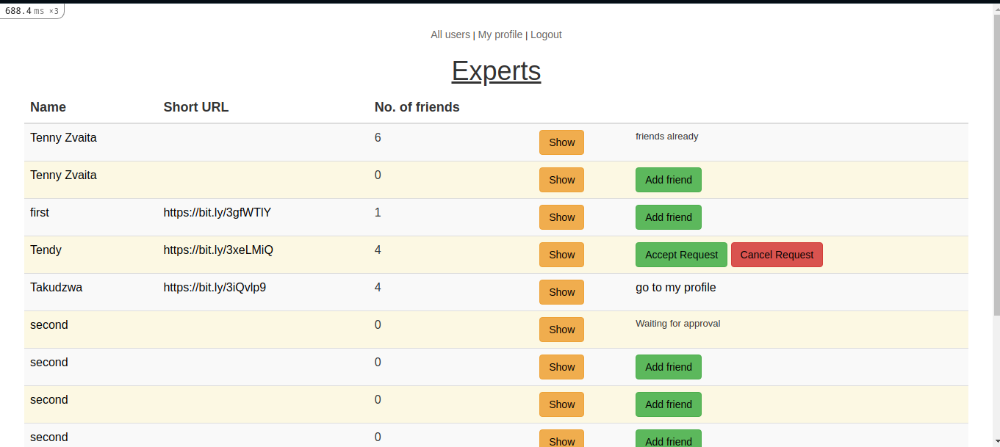

<h1 align="center">
  Expert Finder.
</h1>

<strong>Expert Finder</strong> is a website scraper application built with Ruby on Rails. 

**Home Page**

  

## Features

- Users can sign up and login.
- Once they click the sign up button, the application runs a scraping process and acquires headings(h1-h3) from the given user's website.
- These headings are then stored in the user's headings column.
- Another process that runs is the Bitly url shortening process and the shortened URL is saved in the database as well.
- Users can find experts using a search feature which looks through the headings to find experts in topics of their liking.
- The results show the expert and if there are mutual friends with the found expert they can see a list of them there as well.

### Production Dependencies

| **Dependency**   | **Use**                                              |
| ---------------- | ---------------------------------------------------- |
| postgresql       | Database which supports array columns and deploys easily to heroku |
| Bitly       | URL shortening for easy sharing of links |
| bootstrap-sass       | provides classes for easy css styling |
| rspec-rails       | Behaviour testing for the whole application witheasy syntax |                                  |
| Nokogiri       | Html scraping and html elements querying|
| Open-uri       | open urls with ease |

### Prerequisites

- Ruby
- Rails
- Bundler
- Postgres

### Setup

- git clone `git@github.com:tzvaita/experts.git`
- cd experts
- bundle install
- rails db:migrate
- rails server

## Author

👤 **Tennyson Takudzwa Zvaita**

- Github: [@tzvaita](https://github.com/tzvaita)
- Twitter: [@tennyzvaita](https://twitter.com/tennyzvaita)
- LinkedIn: [tennyzvaita](https://www.linkedin.com/in/tennyzvaita)
- Mail: [tzvaita@gmail.com](tzvaita@gmail.com)

## 🤝 Contributing

Contributions, issues and feature requests are welcome!

Feel free to check the [issues page](https://github.com/tzvaita/react-redux-api-spa/issues).

## Show your support

Give a ⭐️ if you like this project!

## Acknowledgments
  - [Bitly](https://bitly.com/)
  - [Bootstrap](https://getbootstrap.com/)